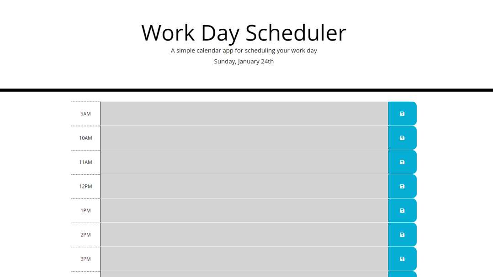

# Work Day Scheduler

## Description

This repo contains a javaScript/jquery web application that records tasks to be completed. This application keeps track of time using moment.js and is divided into nine time blocks that represent standard business hours. The time blocks are color coded to represent past, present, and future categories.

 

* Displays the user with standard business hour time blocks with ability to interact with them
* Time blocks are color coded to represent past, present, and future states
* User enters description for a task and clicks the corresponding save button to store the task
* Application loads any previous stored task on refresh

 

This work day scheduler is intended to provide an interactive, task setting experience for daily assistance.

 

[Work Day Scheduler](https://rickhill543.github.io/work-day-scheduler/)

***

## Installation

N/A

***

## Usage

For dynamically creating task that correspond to standard business hours

 

***

## Credits

W3Schools for always being there | 
[W3Schools](https://www.w3schools.com/)

 

***

## License

All Rights Reserved.